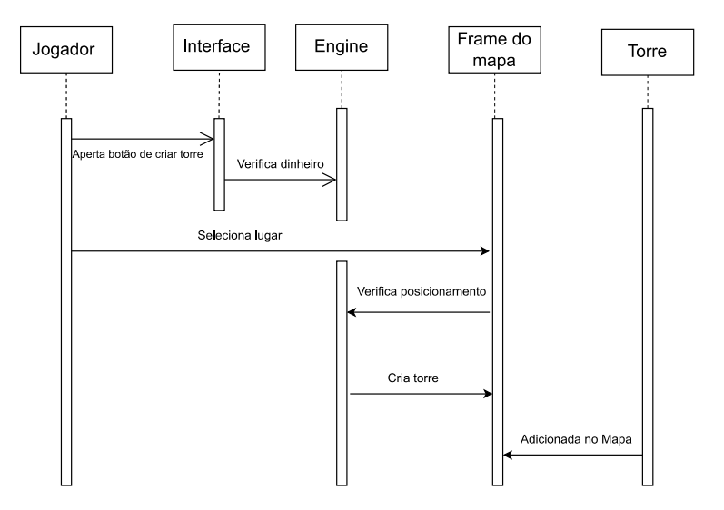

## Diagrama de Sequência 

Um diagrama de sequência tem como finalidade representar, de forma temporal, a interação entre os diferentes componentes de um sistema ao longo da execução de um processo específico. Ele mostra a ordem em que as mensagens são trocadas entre os objetos envolvidos, destacando o fluxo de eventos e a lógica de funcionamento do sistema.
O diagrama de sequência feito refere-se ao caso de uso Criar Torre, ilustrando  como os elementos do sistema interagem para permitir que o jogador posicione uma nova torre.

### Funcionando do Diagrama de sequência: 
Quando o jogador clica no botão de criação de torre na interface, esta envia um comando para a engine do jogo. A engine verifica se o jogador possui dinheiro suficiente. Caso tenha, o processo continua: o jogador escolhe uma posição no mapa para instalar a torre. A engine então verifica se a posição selecionada está disponível. Se estiver, a torre é criada e adicionada ao mapa.

 

    

[Retroceder](dcu.md) | [Avançar](code.md)